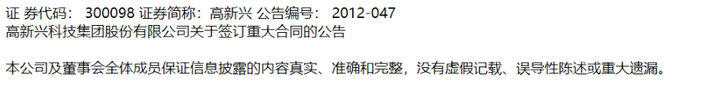
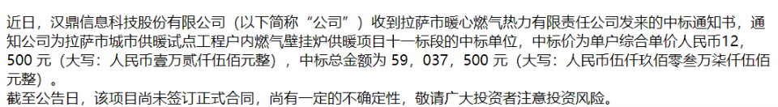

# 大数据项目二 -- 金融文本信息抽取

孙伟杰 陈俊儒 林泽钦

## 概要

## docparser -- html 文件解析

## ner -- 命名实体识别

## extract -- 信息抽取

### 增减持

### 重大合同

在重大合同的信息抽取中，我们需要从文本中提取以下信息：


我们仍然使用 ner 打标签 + 正则匹配的方式提取信息。由于绝大部分关于重大合同的公告中并没有表格，所以这些数据都需要制定特定的匹配规则，下面分别进行叙述。

__乙方__

乙方名称的识别比较容易。一般来说，重大合同的公告都是由乙方发出的，所以公告的标题行很多都是 "xx公司关于xx重大合同的公告"，如下所示：




观察经由 nerTagger 添加标签后的 html 文件发现，标题行中的公司名称一般都能正确地被识别为组织名，并且被 `<org><\org>` 分离开来。基于这个观察，我们决定将文本中第一个识别出来的组织名作为乙方名称。这个规则对所有的 html 文件都有输出 (也就是说所有 html 都能识别出组织名，尽管可能不是在标题行中识别到的)。但是这样识别出来的名称有一个问题：由于 html 解析段落时没能很好分离公告信息行以及标题行，公告信息最后的公告标号会跟标题中的公司名称黏在一起，被整个识别为一个组织。因此，需要一个额外的子程序 `remove_number_in_name()` 来去除这些可能出现的编号。

```python
partyB_pattern = re.compile(r'(<org>)(?P<partyB>.{1,28}?)(</org>)')
	for text in tagged_paragraphs:
	search_obj = partyB_pattern.search(text)
	if search_obj:
		partyB_name = search_obj.group('partyB')
		return self.remove_number_in_name(partyB_name)
	return ''
```

__甲方__

甲方的提取就比乙方难了不少，一个原因是甲方在文中出现的位置并不像乙方那样有固定的模式，并且甲方的上下文环境类型较多，需要浏览大量 html 来确定出现频率较高的句法模式；另一个原因是有很多文件的甲方为 "xx市xx局" 这种不是以公司为后缀的命名实体，而 ner 对这类实体的识别效果并不理想，因此也不能像乙方那样直接用 `<org><\org>` 进行匹配。在经过对训练数据的观察之后，我们制定了如下规则来抽取可能的甲方名称：

+  "与|和 ... 签署|签订"：这里省略号的位置通常就是甲方，如下所示。

  

+ "接到|收到 ... 发来|发出"：一般这种句式用来说明乙方收到了甲方发来的中标通知。

  

甲方的匹配由 `extract_partyA()` 完成，其主要内容就是在各个段落中寻找上述模式。不过这样找到的 "甲方" 可能会有多个，所以需要进行选择，这部分工作由 `select_partyA()` 完成。选择的策略是，对这些名称根据出现次数进行排序，出现频率较高的选为结果返回。如果有两个名称出现次数相等，就检测其之间是否存在包含关系。一般来说，由于实体识别以及规则制定的缺陷，可能会有部分匹配到的名称带有多余的单词，这样作为子串的名称才是正确的名称。如果上述策略依旧无法确定出结果，那就任意返回一个结果。

```python
def extract_partyA(self, tagged_paragraphs):
	partyA_candidates = []
	partyA_pattern = re.compile(r'(与|和)(.*)(<org>)?(?P<partyA>.{1,50}?)(</org>)?(.*)(签订|签署)')
	for text in tagged_paragraphs:
		match_objs = partyA_pattern.finditer(text)
	for match_obj in match_objs:
		partyA_name = match_obj.group('partyA')
		partyA_candidates.append(partyA_name)

	partyA_pattern = re.compile(r'(收到|接到)(<org>)?(?P<partyA>.{1,28}?)(</org>)?(发出|发来)')
	# ... 同上
	
    if len(partyA_candidates) > 0:
		return self.select_partyA(partyA_candidates)
    return ''
```

__项目名称__

抽取的思路与抽取甲方基本相同，只不过规则换为：

+ 用书名号 《》 括起来并且以 "项目"、"标"、"标段" 或者 "工程" 等字眼结尾的 (一种较宽松的规则是只要包含这些字眼，并且这些字眼与 "》" 相隔不超过 10 个字的就选入)；

  

+ 用双引号 “” 括起来并且以 "项目"、"标"、"标段" 或者 "工程" 等字眼结尾的；

  

+ 明显的表明 "项目名称" 的；

  

+ 说明 "中标 xx 标段" 的；

  

+ "为 xx 标|标段|项目" 的。

  

```python
re.compile(r'《(?P<proj_name>.{1,100}?(标|标段|项目|工程))[^，。）》]{1,10}》')
re.compile(r'“(?P<proj_name>.{1,100}?(标|标段|项目|工程))[^，。）》]{1,10}”')
re.compile(r'(中标项目|项目名称)([：“])(?P<proj_name>.{1,100}?)([。”）（])')
re.compile(r'(中标)(?P<proj_name>.{1,100}?标|标段[）]?)')
re.compile(r'([为])(?P<proj_name>[^，。）》]{1,60}?(标|标段|项目))')
```

其中最后一条规则过于宽松，所以要在其他规则没有找到结果时再进行匹配。此外，匹配到的字符串中需要排除 "。"、 "，"、"）" 或者 "》"，这样可以避免出现比较奇怪的、明显不正确的结果。

__合同名称__

与项目名称的抽取相同。规则为：

+ 用书名号 《》 括起来并且以 "合同" 结尾的；

  

+ 明显的表明 "合同名称" 的；

  

__合同金额__

虽然要求提取的是合同金额的上下限，但观察训练集数据发现，大部分公告中的合同金额上下限是相等的，也就是基本上只需要提取合同金额，然后上下限都用这个金额填入。这个抽取策略的确欠缺考虑，但是项目到后面因为时间的原因也没能考虑更为妥当的策略。因此，我们直接对公告中明显出现的 "合同金额"、"金额" 等字眼进行搜索，然后匹配跟在这些单词后方，被 ner 识别为 `<num></num>` 的数字。如果有多个数字匹配成功，则以数字与这些字眼的距离 (间隔字数) 作为准则进行选择。如果上述规则无法识别出合同金额，就简单匹配 `<num></num>` 和 "元" 的组合。

__联合体成员__

时间原因并没有处理这部分数据。

### 定向增发

## 总结